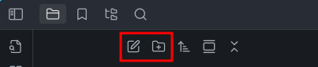
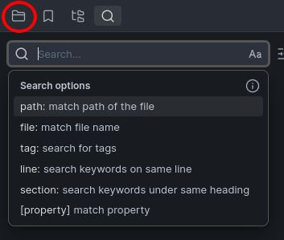

# Что такое Obsidian?

**Obsidian** – это нечто большее, чем текстовый редактор или приложение для заметок. Представь себе личную Википедию, которую создаешь ты сам. Это мощная база знаний, которая хранится локально на твоем компьютере (или телефоне/планшете) в виде простых текстовых файлов.

Весь этот гайд будет рассматривать Obsidian и все сопутствующие инструменты исключительно с точки зрения ведения конспектов лекций. Если тебе хочется узнать больше о "личной Википедии", которая здесь имеется ввиду – загляни в [конец гайда](Аутро.md). Но мы **рекомендуем не забивать этим голову**, пока не освоишь основы.

## Работа с Obsidian

### Файлы и папки

Создать новую заметку можно по хоткею `Ctrl-N`.

И заметки, и папки можно создавать из контекстного меню, открываемого на ПКМ по свободному пространству в файловом представлении.

А также по нажатию кнопок, доступных там же:

Чтобы создать файл или папку внутри уже существующей папки, нужно нажать по ней ПКМ и создать файл/папку из контекстного меню.

### Поиск

Кроме поиска по словам в текущем открытом файле на `Ctrl-F`, в Obsidian (с помощью [плагина](#плагины) **Search**) можно осуществлять поиск по всему хранилищу.

По умолчанию он открывается сочетанием клавиш `Ctrl-Shift-F`. При активации твой курсор будет помещен в строку поиска, в которой ты можешь сразу вводить интересующие ключевые слова. Obsidian найдет все совпадения во всех твоих конспектах, заметках или другого рода записях – незаменимый функционал.

Для возврата к файловому представлению нажми на иконку Files на панельке слева сверху:

### Настройки

Хоткей по умолчанию: `Ctrl-,` (`Ctrl-Б`).

Первый блок "Options" в левом списке окна настроек посвящен конфигурации непосредственно Obsidian. Здесь находятся:

- Поведение редактора
- Внешний вид (в том числе [цветовые темы](Темы-для-Obsidian.md))
- [Горячие клавиши](Горячие-клавиши.md) ("хоткеи")
- Меню управления плагинами

Все, что идет далее – индивидуальные настройки плагинов.

### Плагины

Плагины – дополнительные модули для Obsidian, расширяющие его базовую функциональность. Плагины управляются в двух последних элементах блока настроек "Options".

#### Базовые (core) плагины

Плагины, которые встроены в Obsidian. На их вкладке они указаны списком, с короткими описаниями к каждому, тумблером активности ("включенности"), у некоторых есть кнопки перехода в настройки их [[Горячие клавиши|хоткеев]] или в настройки конфигурации.

#### Внешние (community) плагины

Плагины, разрабатываемые сообществом и не поставляемые с Obsidian из коробки, но легко подключаемые.

У нас есть [отдельная статья](Плагины-для-Obsidian.md) о внешних плагинах: подключение, настройка, полезные плагины – все там!

## Что дальше?

Этого должно быть достаточно, чтобы ты чувствовал себя комфортно в среде Obsidian. Следующие рекомендуемые материалы помогут тебе прокачать сам конспектирование:

- **[Интро в Markdown](Интро-в-Markdown.md)** – язык разметки текста, на котором ты будешь писать заметки.
- **[Интро в LaTeX](Интро-в-LaTeX.md)** – язык разметки для математических формул; [маст-хэв](https://slovaroid.ru/slova/21156243/mast-hev "маст-что?") для технаря.

## Обратная связь

Чего-то не хватает? Что-то было непонятно? Остались вопросы?

- Спроси в (чате)[ссылка на тг чат гайда] ;
- Или можешь [открыть issue](https://github.com/s4turn-dev/obsidian-guide/issues/new) со своим вопросом.

