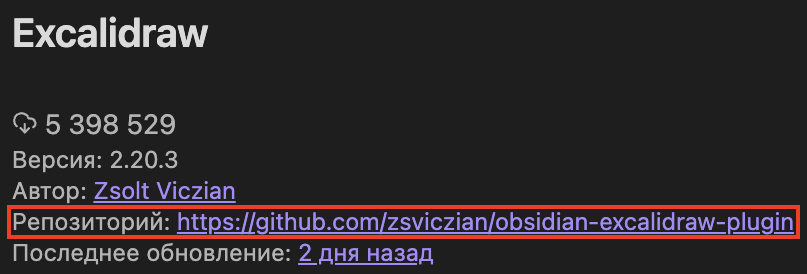

Внешние плагины расширяют функционал Obsidian, автоматизируют рутину и делают работу с конспектами гораздо удобнее.

## Как включить возможность установки плагинов

1. Открой Настройки (`Ctrl+,` / `Cmd+,`).
2. Перейди во вкладку Community Plugins (или Плагины сообщества).
3. Нажми Turn on community plugins — это разрешит установку плагинов не из стандартного набора.
4. Нажми Browse, чтобы открыть каталог плагинов.

## Как установить плагин

1. В разделе **Community Plugins** нажми "Browse".
2. Найди нужный плагин по названию.
3. Нажми Install, затем Enable.

После установки у большинства плагинов появляется вкладка в меню, где можно закастомить их под себя.

## Полезные плагины

- Templater — шаблоны для заметок и лекций,
- Spaced Repetiton — плагин для запоминания слов и терминов,
- Advanced Tables — удобное редактирование таблиц,
- Kanban — канбан-доски для отслеживания прогресса по задачам,
- Periodic Notes — ежедневные, недельные и месячные заметки для планирования.

## Обычно для каждого плагина существует документация

Официальные документации частенько встречаются для каждого плагина, который ты устанавливаешь. Она расположена прямо на странице установки плагина (например, ссылка на репозиторий на GitHub) и помогает в нем лучше разобраться.

## Обратная связь

Чего-то не хватает? Что-то было непонятно? Остались вопросы?

- Спроси в [чате](https://t.me/+rLsgrAwi_b1mYzli),
- или можешь [открыть issue](https://github.com/s4turn-dev/obsidian-guide/issues/new) со своим вопросом.
