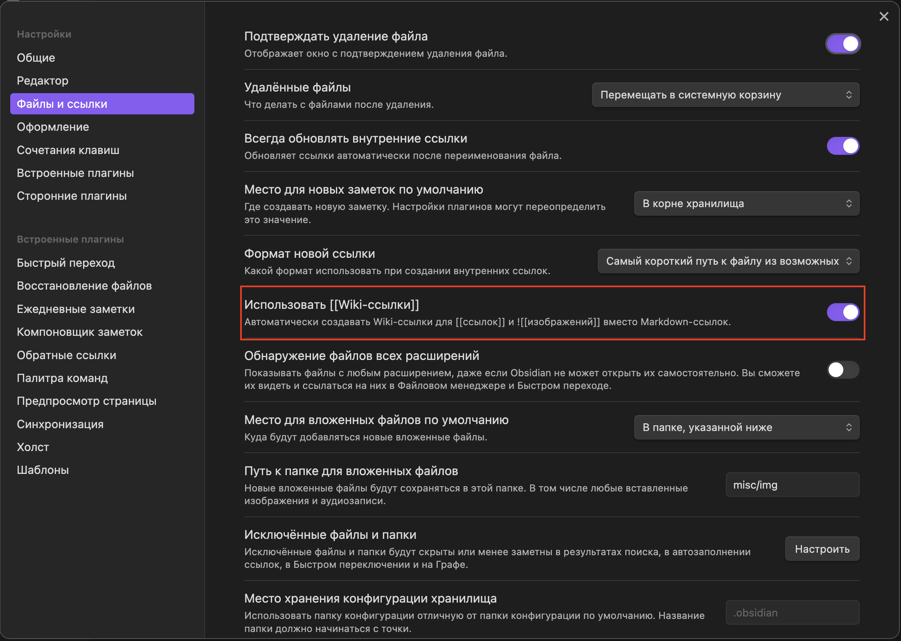

Фишки и приемы для продвинутых `B)`

>[!warning]
>Не все фишки, которые  мы тут покажем, корректно отображаются на GitHub.


## Больше выделения, или HTML

Obsidian из коробки поддерживает HTML – язык разметки, на котором пишутся сайты
и который понимают браузеры, точно как Obsidian понимает и рендерит Markdown.

- Нижний регистр: `H<sub>2</sub>O` -> H<sub>2</sub>O
- Верхний регистр: `E=mc<sup>2</sup>O` -> E=mc<sup>2</sup>
- Подчеркивание: `<u>underline</u>` -> <u>underline</u>

И в целом что угодно, что поддерживается в HTML – в том числе, например,
inline стилизация:

`Это <span style="color: red;">очень важный</span> текст` ->
Это <span style="color: red;">очень важный</span> текст

Гайд не покрывает интро в HTML и его возможности – с этим тебе придется
ознакомиться самостоятельно.


## Callouts

Особые блоки: для особых случаев. Используются как цитаты с парой незначительных изменений и, разумеется, поддерживают Markdown:

```md
>[!info] Заголовок
>
> *Содержание блока.*
>
``` 

Результат:
>[!info] **Заголовок**
>
>*Содержание блока.*

Самая первая строка становится заголовком блока, а `[!info]` в начале – префикс,
определяющий, как блок будет выделен (иконка и цвет). Всего есть 12 префиксов:

>[!info]- Обзор префиксов
>- `note`
>>[!note]
>   
>- `abstract`, `summary`, `tldr`
>>[!summary]
>  
>- `info`, `todo`
>>[!info]
>  
>- `tip`, `hint`, `important`
>>[!tip]
>
>- `success`, `check`, `done`
>>[!done]
>
>- `question`, `help`, `faq`
>>[!question]
>
>- `warning`, `caution`, `attention`
>>[!warning]
>
>- `failure`, `fail`, `missing`
>>[!failure]
>
>- `danger`, `error`
>>[!error]
>
>- `bug`
>>[!bug]
>
>- `example`
>>[!example]
>
>- `quote`, `cite`
>>[!quote]

Еще они умеют сворачиваться: поставь дефис сразу после префикса – и блок будет отображен свернутым. Кликни по нему, чтобы развернуть и кликни еще раз, чтобы свернуть обратно:

```md
>[!info]- Это свернутый блок
> Его содержание доступно только в развернутом виде. Занимает меньше места,
помогает сфокусироваться на главном.
```

Результат:
>[!info]- Это свернутый блок
>Его содержание доступно только в развернутом виде. Занимает меньше места, помогает сфокусироваться на главном.


## Таблицы

Для сравнения, списков, планов или другой структурированной информации таблицы незаменимы.

### Базовый синтаксис:

Все, что тебе нужно – это вертикальные черты `|` для разделения столбцов и дефисы `---` для отделения заголовков от остального содержимого:

0. Отступи пустую строку, если твоей таблице предшествует какой-то текст
1. Перечисли заголовки своей будущей таблицы, ограничивая их `|`:

```| Заголовок 1 | Заголовок 2 | Заголовок 3 |```

2. Перейди на новую строку и напечатай `| - |`
3. Obsidian распознает, что ты вводишь таблицу, автоматически ее завершит и отрендерит

```
| Заголовок 1 | Заголовок 2      | Заголовок 3   |
|-------------|------------------|---------------|
| Строка 1    | Ячейка 1-2       | Ячейка 1-3    |
| Строка 2    | Очень длинное имя| Короткоe имя  |
```

Результат:

| Заголовок 1 | Заголовок 2       | Заголовок 3 |
| ----------- | ----------------- | ----------- |
| Строка 1    | Ячейка 1-2        | Ячейка 1-3  |
| Строка 2    | Очень длинное имя | Коротко     |

### Выравнивание текста:

Чтобы выровнять текст в столбцах таблицы нужно добавить двоеточие `:` в разделительной строке `---`:
- `:` слева - выравнивание по левому краю (по умолчанию).
- `:` справа - выравнивание по правому краю.
- `:` с обеих сторон - выравнивание по центру.

```
| Лево       | Центр    | Право       |
|:-----------|:--------:|------------:|
| АБВ        | ГДЕ      | ЖЗИ         |
| 123        | 456      | 789         |
```

Результат:

| Лево | Центр | Право |
| :--- | :---: | ----: |
| АБВ  |  ГДЕ  |   ЖЗИ |
| 123  |  456  |   789 |

### Навигация и взаимодействие:

- **Перемещение по таблицу:** На `<Tab>` и `<Shift>+<Tab>` ты можешь перемещать курсор вперед/назад соответственно между ячейками таблицы. На `<Enter>` ты перенесешь курсор в ячейку под текущей.

- **Вставка новых строк и столбцов:** Наведи курсор чуть-чуть за последний столбец/строку – появится кнопка, нажатие на которую дополнит таблицу в данном направлении.`<Tab>` в последней ячейке последней строки создаст новую строку и перенесет курсор в ее первую ячейку, а `<Enter>` в последней строке создаст новую строку и перенесет курсор в ячейку под текущей. А еще столбцы и строки можно вставить и удалить через контекстное меню, вызываемое щелчком ПКМ по таблице:  


- **Изменение порядка:** Наведи курсор немного над заголовками или перед первым столбцом – появится кнопка, потянув которую ты можешь передвинуть данный столбец/строку:  


Для упрощенного взаимодействия с таблицами рекомендуем ознакомиться с плагином "Advanced Tables". Подробнее о нем и о том, как устанавливать плагины смотри в статье [[Плагины-для-Obsidian|Плагины для Obsidian]].


## Ссылки

Ссылки – механизм Obsidian, который превращает неорганизованную структуру файлов в связанную систему.

### Ссылки на другие заметки:

^055ff3

- **Wiki-стиль:** `[[Название заметки]]`. Это самый простой способ: пишешь название заметки в двойных квадратных скобках, и Obsidian предложит автодополнения. С помощью стрелок ты можешь выбрать между найденными им совпадениями, а на `<Enter>` принять выбранное дополнение и перенести курсор за пределы ссылки. Дефолтная комбинация клавиш `<Ctrl>+K` быстро вставит Wiki-ссылку и переместит курсор внутрь.

- **Стандартный (Markdown) стиль:** `[текст ссылки](путь/к/заметке.md)`. Этот стиль более универсален. Он поддерживает ссылки не только на внутренние заметки, но еще и, например, на сайты, и работает не только в Obsidian, но и в других Markdown-редакторах.

В настройках Obsidian в разделе "Файлы и ссылки" есть опция "Использовать вики-ссылки". Рекомендуем включить данные ссылки, их стиль проще и понятнее.


### Ссылки на заголовки внутри заметки:

Данные ссылки помогают ориентироваться внутри длинной заметки.

- Если заголовок находится в другой заметке: `[[Название заметки#Заголовок_раздела]]`.
- Если заголовок находится в той же заметке: `[[#Заголовок_раздела]]`. Также через знак `|` можешь изменить название отображаемой ссылки: `[[Лекция_5#Введение|К введению Лекции 5]]`.

### Ссылки на отдельные параграфы (блочные ссылки):

Идеальный вариант ссылок, если тебе нужно сослаться не на целый заголовок, а на конкретный абзац или даже строчку текста.

Дописать синтаксис + можно добавить пример прям в данной заметке, например "эта ссылка перенесет на начало статьи"

### Встраивание содержимого ссылок:

Бывает, что содержимое ссылки нужно видеть "здесь и сейчас", тогда на помощь приходит символ `!`. Он позволяет отобразить содержимое ссылки прямо в текущей заметке.
 - **Вставить целую заметку:** `![[Название заметки]]` – вставит весь текст из "Название заметки" прямо сюда.
 - **Вставить заголовок:** `![[Название заметки#Заголовок]]` – вставит только содержимое конкретного заголовка из другой заметки.
 - **Вставить отдельный параграф (блок заметки):** ... вставит только тот самый абзац, на который ты поставил блочную ссылку.  + описать процесс как ссылки оформляются через обычную ссылку, потом obsidiain подтягивает абзацы и генерит тег


[[Продвинутый-Markdown#^055ff3|ccoo]]

## Метадата / Шапка статьи

как она работает, как пользоваться, каких типов данных могут быть атрибуты
и советы по использованию (например что можно туда класть ссылки на предыдущую
и следующую лекцию)

