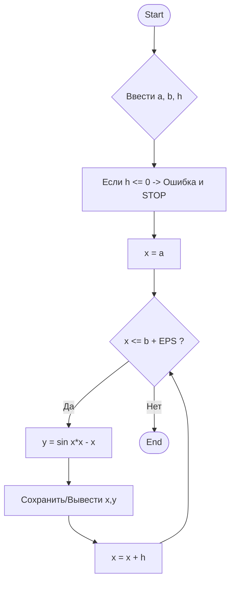
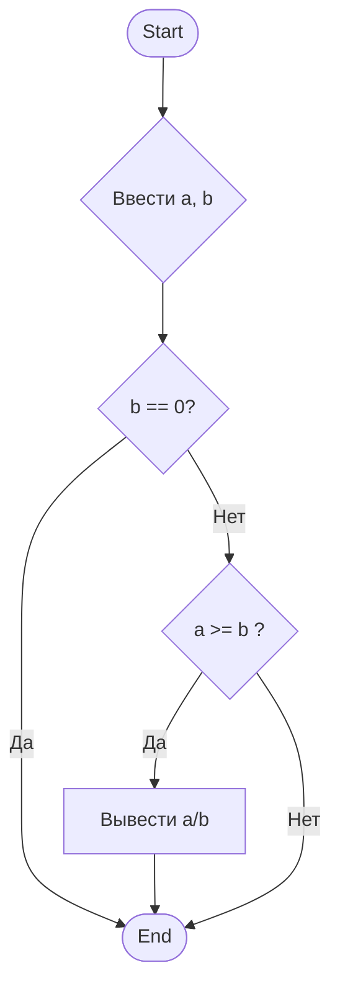

Фишки и приемы для продвинутых `B)`

>[!warning]
>Не все фишки, которые  мы тут покажем, корректно отображаются на GitHub.


## Содержание

1. [[#Больше выделения, или HTML]]
2. [[#Callouts]]
3. [[#Таблицы]]
4. [[#Ссылки]]
5. [[#Шапка статьи, или Метадата]]
6. [[#Mermaid]]

## Больше выделения, или HTML

Obsidian из коробки поддерживает HTML – язык разметки, на котором пишутся сайты
и который понимают браузеры, точно как Obsidian понимает и рендерит Markdown. ^3d1f9e

- Нижний регистр: `H<sub>2</sub>O` -> H<sub>2</sub>O
- Верхний регистр: `E=mc<sup>2</sup>O` -> E=mc<sup>2</sup>
- Подчеркивание: `<u>underline</u>` -> <u>underline</u>

И в целом что угодно, что поддерживается в HTML – в том числе, например,
inline стилизация:

`Это <span style="color: red;">очень важный</span> текст` ->
Это <span style="color: red;">очень важный</span> текст

Гайд не покрывает интро в HTML и его возможности – с этим тебе придется
ознакомиться самостоятельно.


## Callouts

Особые блоки: для особых случаев. Используются как цитаты с парой незначительных изменений и, разумеется, поддерживают Markdown:

```md
>[!info] Заголовок
>
> *Содержание блока.*
>
``` 

Результат:
>[!info] **Заголовок**
>
>*Содержание блока.*

Самая первая строка становится заголовком блока, а `[!info]` в начале – префикс,
определяющий, как блок будет выделен (иконка и цвет). Всего есть 12 префиксов:

>[!info]- Обзор префиксов
>- `note`
>>[!note]
>   
>- `abstract`, `summary`, `tldr`
>>[!summary]
>  
>- `info`, `todo`
>>[!info]
>  
>- `tip`, `hint`, `important`
>>[!tip]
>
>- `success`, `check`, `done`
>>[!done]
>
>- `question`, `help`, `faq`
>>[!question]
>
>- `warning`, `caution`, `attention`
>>[!warning]
>
>- `failure`, `fail`, `missing`
>>[!failure]
>
>- `danger`, `error`
>>[!error]
>
>- `bug`
>>[!bug]
>
>- `example`
>>[!example]
>
>- `quote`, `cite`
>>[!quote]

Еще они умеют сворачиваться: поставь дефис сразу после префикса – и блок будет отображен свернутым. Кликни по нему, чтобы развернуть и кликни еще раз, чтобы свернуть обратно:

```md
>[!info]- Это свернутый блок
> Его содержание доступно только в развернутом виде. Занимает меньше места,
помогает сфокусироваться на главном.
```

Результат:
>[!info]- Это свернутый блок
>Его содержание доступно только в развернутом виде. Занимает меньше места, помогает сфокусироваться на главном.


## Таблицы

Для сравнения, списков, планов или другой структурированной информации таблицы незаменимы.

Все, что тебе нужно – это вертикальные черты `|` для разделения столбцов и дефисы `---` для отделения заголовков от остального содержимого:

0. Отступи пустую строку, если твоей таблице предшествует какой-то текст
1. Перечисли заголовки своей будущей таблицы, ограничивая их `|`:

```| Заголовок 1 | Заголовок 2 | Заголовок 3 |```

2. Перейди на новую строку и напечатай `| - |`
3. Obsidian распознает, что ты вводишь таблицу, автоматически ее завершит и отрендерит

| Заголовок 1 | Заголовок 2 | Заголовок 3 |
| ----------- | ----------- | ----------- |
|             |             |             |

4. Можешь дописать то, что нужно в ячейках таблицы. В конце концов ее markdown синтаксис будет выглядеть как:

```
| Заголовок 1 | Заголовок 2       | Заголовок 3   |
|-------------|-------------------|---------------|
| Строка 1    | Ячейка 1-2        | Ячейка 1-3    |
| Строка 2    | Очень длинное имя | Короткоe имя  |
```

Результат:

| Заголовок 1 | Заголовок 2       | Заголовок 3 |
| ----------- | ----------------- | ----------- |
| Строка 1    | Ячейка 1-2        | Ячейка 1-3  |
| Строка 2    | Очень длинное имя | Коротко     |

Для упрощенного взаимодействия с таблицами рекомендуем ознакомиться с плагином "Advanced Tables". Подробнее о нем и о том, как устанавливать плагины смотри в статье [[Плагины-для-Obsidian|Плагины для Obsidian]].


## Ссылки

Ссылки – механизм Obsidian, который превращает неорганизованную структуру файлов в связанную систему.

### Типы ссылок

- **Wiki-стиль:** `[[Название заметки]]`. Это самый простой способ: пишешь название заметки в двойных квадратных скобках, и Obsidian предложит автодополнения. С помощью стрелок ты можешь выбрать между найденными им совпадениями, а на `<Enter>` принять выбранное дополнение и перенести курсор за пределы ссылки. Дефолтная комбинация клавиш `<Ctrl>+K` быстро вставит Wiki-ссылку и переместит курсор внутрь.

- **Стандартный (Markdown) стиль:** `[текст ссылки](путь/к/заметке.md)`. Этот стиль более универсален. Он поддерживает ссылки не только на внутренние заметки, но еще и, например, на сайты.

В настройках Obsidian в разделе "Файлы и ссылки" есть опция "Использовать вики-ссылки". Рекомендуем включить данные ссылки, их стиль проще и понятнее. Далее мы будем рассматривать именно вики-ссылки.


### Виды ссылок

Вики-ссылки поддерживают синтаксис, который определяет, на что именно ссылка будет ссылать.

1. **Стандартные ссылки** (ссылки на заметки)

Ссылаются на другую заметку (файл, картинку): `[[Название заметки]]`

2. **Ссылки на заголовки внутри заметки**

Данные ссылки позволяют перейти на конкретный параграф другой заметки.

- Если заголовок находится в другой заметке: `[[Название заметки#Заголовок_раздела]]`.
- Если заголовок находится в текущей заметке: `[[#Заголовок_раздела]]`. 

3. **Ссылки на отдельные параграфы**

Можно сослаться даже на конкретный абзац или просто строчку текста.

- В другой заметке: `[[Заметка^якорь]]`.
- В текущей: `[[^якорь]]`.

Здесь "якорь" это который выглядит так: `^151gho`, `^im-anchor` -- и ставится после абзаца (Obsidian ставит через пустую строчку, функционально можно и вплотную к последнему слову: `...end of paragraph.^anchor`)

>[!tip]- Как Obsidian помогает со ссылками
>Обсидиан облегчает процесс:
>1. Начни вводить свою ссылку как обычно: `[[Какая-то-заметка]]`. Помни, что на `<Tab>` можно автоматически дополнять, при этом оставаясь внутри `[[ ]]`.
>2. После того, как ввел название заметки, впиши символ `^`. Обсидиан высветит подсказки по абзацам. Ты можешь вводить фрагменты из абзаца, и Обсидиан сузит подходящие дополнения: 
>	![[Продвинутый-Markdown_блочные-ссылки-1.png]]
>	Все то же работает и с `#`.
>3. Чтобы завершить ссылку на абзац, обязательно воспользуйся автодополнением (`<Tab>`): Обсидиан автоматически сгенерирует тег и подставит его в нужной заметке после абзаца, который ты выбрал (стрелки вверх-вниз), и завершит текущую ссылку этим тегом:
>	![[Продвинутый-Markdown_блочные-ссылки-2.png]]
>
>В итоге в исходной заметке получится:
>
>![[Продвинутый-Markdown_блочные-ссылки-3.png]]

### Полезные приемы

Есть еще пара приятных приемов при работе со ссылками.

- **Смена отображаемого текста**

Через знак `|` можешь изменить отображаемый текст ссылки: `[[Лекция_5#Введение|К введению Лекции 5]]`.

- **Встраивание содержимого ссылок**

Символ `!` перед ссылкой позволит отрендерить ее содержимое "здесь и сейчас":

 - `![[Название-заметки]]` – отобразит весь текст из "Название-заметки" прямо сюда.
 - `![[Название-заметки#Заголовок]]` – отобразит только содержимое под конкретным заголовком.
 - `![[Название-заметки#^6230cd]]` -- вставит только абзац, на который ссылается тег.

Пример: `![[#^3d1f9e]]` -> ![[#^3d1f9e]] 


## Шапка статьи, или Метадата

*Метаданные* -- функционал Obsidian, который позволяет фиксировать информацию о данной заметке. Выглядит это так:

![[Продвинутый-Markdown_мета.png]]

Есть несколько видов тегов:
- **Текст**; может быть ссылками -- как внешними, так и внутренними (обязательно `"[[в кавычках]]"`)
- **Число**
- **Дата** и **Дата-время**
- **Тег**
- **Список**

Более подробно: https://help.obsidian.md/properties

>[!tip]- Как это использовать?
>Одним из самых полезных применений, которое мы этому нашли -- помощь в *навигации между лекциями* или другими упорядоченными между собой заметками (например, официальные вопросы для подготовки в экзамену):
>![[Продвинутый-Markdown_мета-2.png]]


## Mermaid

**Mermaid** -- утилита, позволяющая рендерить схемы и диаграммы из текстовых описаний. Иногда бывает полезнее, чем рисовать рисунки или пытаться изобразить текстом.

Пример:

````

````

Получится:



Песочница с шаблонами: https://mermaid.live/edit (==не все работает в Obsidian==)
Документация по синтаксису: https://mermaid.ai/open-source/syntax/flowchart.html


## Обратная связь

Чего-то не хватает? Что-то было непонятно? Остались вопросы?

- Спроси в [чате](https://t.me/+rLsgrAwi_b1mYzli),
- или можешь [открыть issue](https://github.com/s4turn-dev/obsidian-guide/issues/new) со своим вопросом.
