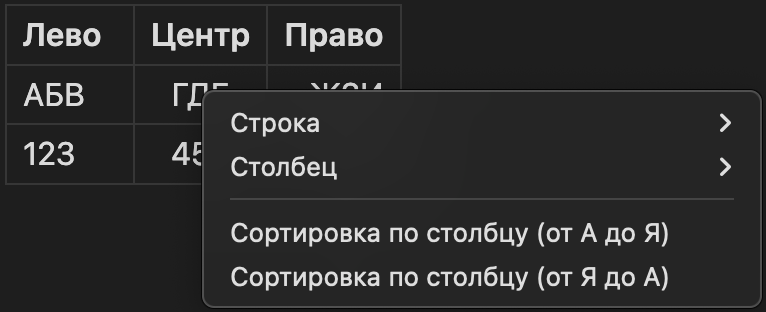
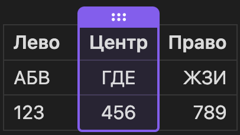

Фишки и приемы для продвинутых `B)`

К сожалению, некоторые фишки заточены именно под obsidian, поэтому, если хочешь использовать форматирование заметок по максимуму, просто склонируй репозиторий и открой папку с ним как хранилище 😉.

## Больше выделения, или HTML

Obsidian из коробки поддерживает HTML – язык разметки, на котором пишутся сайты
и который понимают браузеры, точно как Obsidian понимает и рендерит Markdown.

- Нижний регистр: `H<sub>2</sub>O` -> H<sub>2</sub>O
- Верхний регистр: `E=mc<sup>2</sup>O` -> E=mc<sup>2</sup>
- Подчеркивание: `<u>underline</u>` -> <u>underline</u>

И в целом что угодно, что поддерживается в HTML – в том числе, например,
inline стилизация:

`Это <span style="color: red;">очень важный</span> текст` ->
Это <span style="color: red;">очень важный</span> текст

Гайд не покрывает интро в HTML и его возможности – с этим тебе придется
ознакомиться самостоятельно.


## Callouts

Особые блоки: для особых случаев. Используются как цитаты с парой незначительных изменений и, разумеется, поддерживают Markdown:

```md
>[!info] Заголовок
>
> *Содержание блока.*
>
``` 

Результат:
>[!info] **Заголовок**
>
>*Содержание блока.*

Самая первая строка становится заголовком блока, а `[!info]` в начале – префикс,
определяющий, как блок будет выделен (иконка и цвет). Всего есть 12 префиксов:

- `abstract`, `summary`, `tldr`

>[!summary]

- `info`, `todo`

>[!info]

- `tip`, `hint`, `important`

>[!tip]

- `question`, `help`, `faq`

>[!question]

- `warning`, `caution`, `attention`

>[!warning]

- `failure`, `fail`, `missing`

>[!failure]

- `danger`, `error`

>[!error]

- `bug`

>[!bug]

- `example`

>[!example]

- `quote`, `cite`

>[!quote]

Еще они умеют сворачиваться: поставь дефис сразу после префикса – и блок будет
отображен свернутым. Кликни по нему, чтобы развернуть и кликни еще раз, чтобы
свернуть обратно:

```md
>[!info]- Это свернутый блок
> Его содержание доступно только в развернутом виде. Занимает меньше места,
помогает сфокусироваться на главном.
```

Результат:

>[!info]- Это свернутый блок
>Его содержание доступно только в развернутом виде. Занимает меньше места, помогает сфокусироваться на главном.


## Таблицы

Для сравнения, списков, планов или другой структурированной информации таблицы незаменимы.

**Базовый синтаксис:**

Все, что тебе нужно - это использовать вертикальные черты `|` для разделения столбцов и дефисы `---` для отделения заголовков от остального содержимого:

```
| Заголовок 1 | Заголовок 2      | Заголовок 3   |
|-------------|------------------|---------------|
| Строка 1    | Ячейка 1-2       | Ячейка 1-3    |
| Строка 2    | Очень длинное имя| Короткоe имя  |
```

Результат:

| Заголовок 1 | Заголовок 2      | Заголовок 3   |
|-------------|------------------|---------------|
| Строка 1    | Ячейка 1-2       | Ячейка 1-3    |
| Строка 2    | Очень длинное имя| Коротко       |

**Выравнивание текста:**

Чтобы выровнять текст в столбцах таблицы нужно добавить двоеточие `:` в разделительной строке `---`:
*   `:` слева - выравнивание по левому краю (по умолчанию).
*   `:` справа - выравнивание по правому краю.
*   `:` с обеих сторон - выравнивание по центру.

```
| Лево       | Центр    | Право       |
|:-----------|:--------:|------------:|
| АБВ        | ГДЕ      | ЖЗИ         |
| 123        | 456      | 789         |
```

Результат:

| Лево | Центр | Право |
| :--- | :---: | ----: |
| АБВ  |  ГДЕ  |   ЖЗИ |
| 123  |  456  |   789 |

**Навигация и взаимодействие:**

*   **Вставка по ПКМ (правой кнопке мыши):** Если кликнуть в режиме редактирования по таблице правой кнопкой мыши, то появится контекстное меню, где можно быстро добавить строку или столбец.


*   **Перемещение по Tab:** Нажимая `Tab` внутри ячейки, ты будешь перемещаться по ячейкам, а на последней ячейке `Tab` создаст новую строку - очень удобно для быстрого заполнения.

*   **Изменение порядка:** В режиме предпросмотра ты можешь потянуть столбец или строку (удерживая левую кнопку мыши на заголовке столбца или на цифре строки), чтобы поменять их местами.


Также для более удобного создания и редактирования таблиц рекомендуем установить плагин "Advanced Tables". Подробнее о нём и о том, как устанавливать плагины смотри в статье (ссылка на статью с плагинами).


## Ссылки

- на другие заметки (оба стиля: wiki и дефолтные; упомянуть тумблер настроек
"использовать вики ссылки")
- на отдельные параграфы
- на целые заголовки
- на статьи целиком 

и про функционал, который позволяет рендерить содержимое ссылок
(там че-то `!` добавить перед ссылкой вроде и все)


## Метадата / Шапка статьи

как она работает, как пользоваться, каких типов данных могут быть атрибуты
и советы по использованию (например что можно туда класть ссылки на предыдущую
и следующую лекцию)
