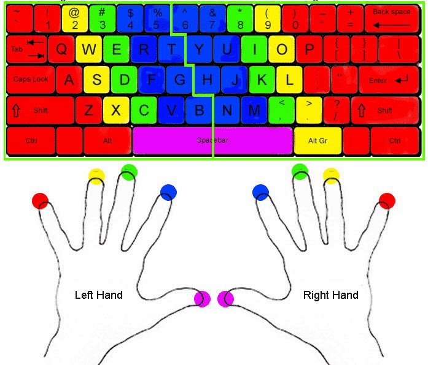

Если печатаешь медленно – можешь забыть про цифровые конспекты.

Серьезно, **скорость печати – фундамент** для ведения конспектов с клавиатуры, без которого весь остальной гайд бесполезен.

Если ты привык записывать лекции в тетрадь и часто не успеваешь за лектором, то знай: скорость письма от руки имеет свой предел. Но что, если мы скажем, что печатать можно быстрее, чем ты пишешь, и даже быстрее, чем говоришь?

## Слепая печать

Слепая печать — это умение печатать, не глядя на клавиатуру. Оно заключается в мышечной памяти пальцев. Главное преимущество слепой печати – возможность держать глаза на экране, а мысли – в лекции. Именно это умение по-настоящему упрощает ведение конспектов и выводит общую продуктивность на совершенно новый уровень.

## Десятипальцевая печать

Одним из методов быстрого набор текста -- **десятипальцевая печать**. Это самый эффективный метод. Составитель курса лично и теперь готов поделиться опытом.

Основой для такого набора текста служит "исходная позиция", когда пальцы левой руки располагаются на клавишах "Ф", "Ы", "В", "А" (A, S, D, F), а правой — на "О", "Л", "Д", "Ж" (J, K, L, ;).
**Главный принцип:** за каждым пальцем закреплена своя щона клавиш. Это позволяет минимизировать лишние движения рук и добиться высокой скорости печати.

>[!tip] Совет
> Ты наверняка замечал небольшие выпуклости на клавиатуре на клавишах `F` и `J` -- именно они помогают быстро найти исходную позицию всех пальцев наощупь.

Будь готов к тому, что поначалу скорость набора неизбежно снизится. Рукам будет непривычно находиться в "исходной" позиции, а пальцы могут самопроизвольно нажимать не те клавиши. Не бойся этих трудностей! Со временем мышечная память возьмёт свое, и ты заметишь, как скорость начнёт расти. Главная цель на начальном этапе -- **точность и правильность нажатий**, а скорость придет со временем сама.

## Как научиться?

- **Тренируйся каждый день** по 10-15 минут. Мы рекомендуем:
    - [keybr.com ](https://www.keybr.com) – отличный сайт для изучения слепой печати с нуля.
    - [monkeytype.com](https://monkeytype.com) – советуем перейти к нему после обучения на keybr.com: тут естественные слова (не наборы букв) и тонкие настройки.
- **Перестань смотреть на клаву**. Поначалу будет непривычно, и твоя скорость неизбежно просядет – это нормально.
- **Практикуйся на лекциях**. Чем больше пишешь конспектов, тем быстрее закрепляется навык

Освоение слепой печати -- это лишь первый шаг. Чтобы по-настоящему отточить мастерство, важно не останавливаться на достигнутом. Постоянная практика, как в процессе обучения, так и после него, является ключом к значительному росту скорости и точности набора.

Комбинация слепой и десятипальцевой печати -- твой ключ к аккуратным цифровым конспектам лекций за диктовкой препода без стресса и напряга.

## Обратная связь

Чего-то не хватает? что-то было непонятно? остались вопросы?

- Спроси в [чате](ссылка на тг чат гайда) ;
- Или можешь [открыть issue](https://github.com/s4turn-dev/obsidian-guide/issues/new) со своим вопросом.

